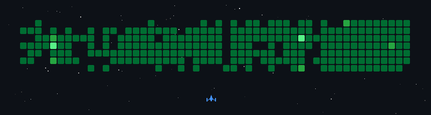

### Hi there 👋, I'm Rohith K

- 🔭 I'm currently working on a **full-stack food ordering platform**
- 🌱 I'm currently learning **Gen AI & Prompt Engineering**
- 🤝 I'm looking to collaborate on **Fintech & AI projects**
- 📫 How to reach me: worksbyrohith@gmail.com
- 😄 Pronouns: he/him
- ⚡ Fun fact: I turn creative ideas into functional, impactful solutions!

<h3 align="left">Languages and Tools:</h3>

 

<h3 align="left">📊 GitHub Stats:</h3>

  
    
  
    
  

<h3 align="left">📈 GitHub Contributions Graph:</h3>

<h3 align="left">✍️ Quote:</h3>

  

  
   
  <i>© Rohith K · worksbyrohith</i>

